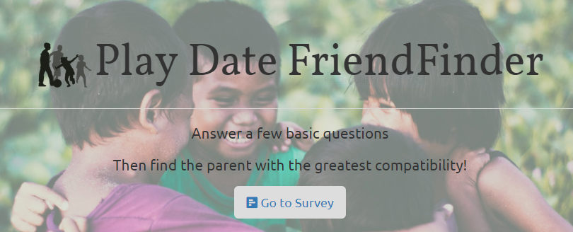
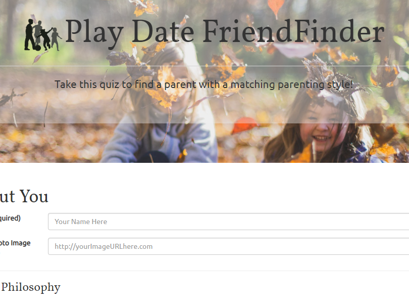
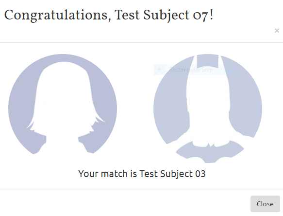

## Play Date - FriendFinder

A match-making app of sorts, for parents to find other like-minded parents so as to arrange Play Dates for their children.
In a perfect world, I would have preferred to match the children themselves up with compatible playmates, but this would have required parents to:
* honestly assess/rank their own child's qualities to match them with other kids
* enable other parents to rank/evaluate those children post-play date

I'm not a monster. I just ask parents to quantify their own parenting style, to be matched up with similar folks. The kids will sort themselves out.

---
The live app is here [https://playdate-ff.herokuapp.com/](https://playdate-ff.herokuapp.com/  "Play Date FriendFinder")

---
### Technologies Used
* `Node.js`
    * `Express`
    * `path`  
* `jQuery` + `AJAX` 
* `RegEx` 
* `Git`
* `Heroku`
* `Postman` (for testing)

---
### How It Works

* The front-end will be composed of a basic <a href="https://www.surveymonkey.com/mp/likert-scale/" target="blank">Likert</a> survey for parents to complete.
---

* The back-end will take in results from the parent surveys, save them, then compare their answers with those from other parents.
---

* The app will then display the name and picture of the parent whose results are the closest match, so that they might be contacted to arrange for a Play date. 
---